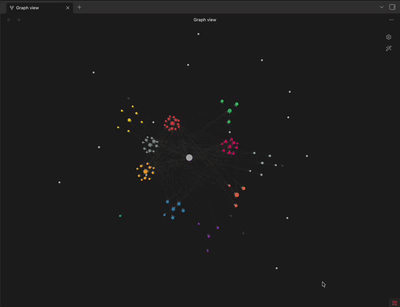

# Orrery

**Turn Obsidian's graph view into a living galaxy.**

Orrery re-lays the built-in graph as a solar system: your most-linked note
becomes a central **black hole**, each folder becomes a **planet** with its notes
orbiting as **moons**, and link-free notes drift in an outer **Oort cloud** -
some of them streaking through on **comet** orbits that dive toward the centre.
The whole thing spins, smoothly and forever.

It works on **any vault automatically** - the structure is read from your folders,
so there's nothing to configure to get started.

<p align="center">
  
</p>

<!-- To refresh the GIF: open the graph, Cmd+Shift+5 to screen-record a ~10s loop,
     then convert (e.g. `ffmpeg -i clip.mov -vf "fps=20,scale=720:-1" docs/preview.gif`
     or https://gif.ski) and commit it to docs/preview.gif. -->

## What it does

- **Black hole** - your most-connected note is pinned dead centre; everything
  orbits it.
- **Planets + moons** - each folder clusters together. Its most-linked note sits
  at the centre; the rest orbit it as a disc of moons.
- **Meaningful distances** - well-connected folders orbit closer in, peripheral
  ones further out, so it's a real galaxy, not a uniform ring.
- **Oort cloud** - link-free notes scatter in a slow outer halo, detached.
- **Comets** - a tunable share of the Oort cloud follow elongated Keplerian
  orbits (the black hole at a focus): they drift out, then whip in close to the
  centre and back.
- **Orbit trails** - planets and comets leave a faint, fading "comet tail" along
  their path, so you can see the orbits at a glance. Toggle on/off in settings.
- **Smooth, rigid spin** - the disk rotates as one, so clusters keep their
  spacing and never tangle; moons still circle their own planet.
- **Fits your screen** - the galaxy zooms to fit on first open, whatever the size
  of your vault.

Grouping is derived purely from your **folder structure** - never from the graph's
colour groups. A manual override is available for power users.

## Install

Orrery isn't in the community store (it uses Obsidian's internal graph APIs).

**BRAT (recommended - auto-updates)**
1. Install the **BRAT** community plugin.
2. BRAT -> *Add beta plugin* -> `WestTee/obsidian-orrery`.
3. Enable **Orrery** in *Settings -> Community plugins*.

**Manual**
1. Download `main.js`, `manifest.json`, and `versions.json` from the
   [latest release](https://github.com/WestTee/obsidian-orrery/releases/latest).
2. Drop them into `<your-vault>/.obsidian/plugins/orrery/`.
3. Enable **Orrery** in *Settings -> Community plugins*.

> **Desktop only.** Not tested or supported on mobile.

## Usage

Open the **Graph view** and Orrery takes over the layout. Everything is live -
drag a node and the web responds; turn motion off and it eases to a dead-still
frame.

**Commands** (Cmd/Ctrl+P):
- *Toggle galaxy motion (spin)*
- *Re-center / re-animate clusters*
- *Fit galaxy to view*
- *Log galaxy diagnostics* (for troubleshooting)

## Settings

| Group | Setting | What it does |
|---|---|---|
| | **Reset to defaults** | Restore everything to the shipped defaults |
| | **Enable** | Master on/off |
| Motion | **Galaxy motion (spin)** | Rotate the galaxy around the hub |
| Motion | **Rotation speed** | How fast it spins |
| Motion | **Moon orbit speed** | How fast moons circle their planet (1 = locked to the disk) |
| Layout | **Separation strength** | How crisply folders hold their zone |
| Layout | **Group spread** | Ring radius - how far apart the planets sit |
| Layout | **Cluster tightness** | Size of each planet's moon disc |
| Comets | **Comet fraction** | Share of the Oort cloud on comet orbits (0 = none) |
| Comets | **Comet speed** | Comet pace, relative to rotation speed |
| Comets | **Comet reach** | How far out comets swing (aphelion) |
| Comets | **Comet dive** | How close they dive to the black hole (perihelion) |
| View | **Fit to view on open** | Zoom the galaxy to fit when a graph opens |
| View | **Orbit trails** | Fading comet-tail along each planet's and comet's orbit (on/off) |
| Advanced | **Manual group override** | Force specific folder groups + ring order |

## How it works (and the risk)

Obsidian runs the graph's force simulation in a **Web Worker**, and a plugin
can't inject custom forces - it can only pin nodes via
`worker.postMessage({ forceNode, ... })`. So Orrery computes every node's target
position each frame (orbits, discs, halo, comets) and pins it there. Because the
motion is driven directly, it's deterministic and jitter-free; when motion is off
it eases into place and then stops.

This relies on **undocumented Obsidian internals** (`leaf.view.renderer` and the
graph worker), so an Obsidian update could break it. It only affects how the graph
is **drawn** - it never reads or writes your notes. Disable the plugin and the
graph returns to normal instantly. *Not affiliated with Obsidian.*

## Development

```bash
npm install
npm run dev     # watch + rebuild main.js on save
npm run build   # type-check + production build
```

Reload the plugin after building (toggle it off/on, or reload Obsidian). Cut a
release by pushing a version tag - the GitHub Action builds and attaches the
assets:

```bash
git tag 0.1.0 && git push --tags
```

## License

[MIT](LICENSE) (c) WestTee
